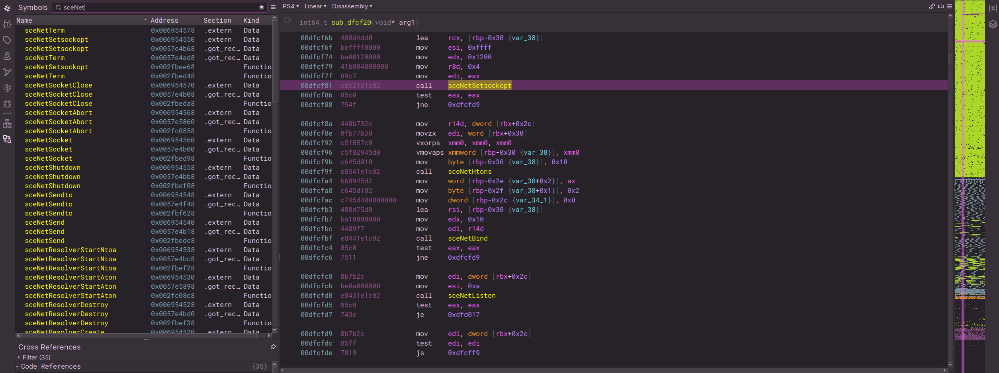

# PS4 ELF Loader

Authors: [droogie](https://github.com/droogie), [sen](https://github.com/0bs3n)

_Loader for PS4 ELF binaries._

This is a PS4 ELF binaryview plugin for Binary Ninja.

This was hacked together via the official ELF view that ships with Binary Ninja,
the [OpenOrbis PS4 ELF Specification](https://github.com/OpenOrbis/OpenOrbis-PS4-Toolchain/wiki/PS4-ELF-Specification) and [ps4libdoc](https://github.com/idc/ps4libdoc/tree/header).

## Usage

This loader is intended to be used with binaries that have already been **decrypted**.

Simply load an a PS4 binary with options, close the standard ELF tab and continue with the PS4 tab enabled to use the loader. Your view name on the top left of the disassembly pane should have a `PS4` prefix. 

## Building

Building the architecture plugin requires `cmake` 3.9 or above. You will also need the
[Binary Ninja API source](https://github.com/Vector35/binaryninja-api).

Run `cmake`. This can be done either from a separate build directory or from the source
directory. Once that is complete, run `make` in the build directory to compile the plugin.

The plugin can be found in the root of the build directory as `libview_ps4.so`,
`libview_ps4.dylib` or `libview_ps4.dll` depending on your platform.
